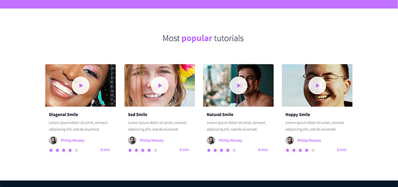
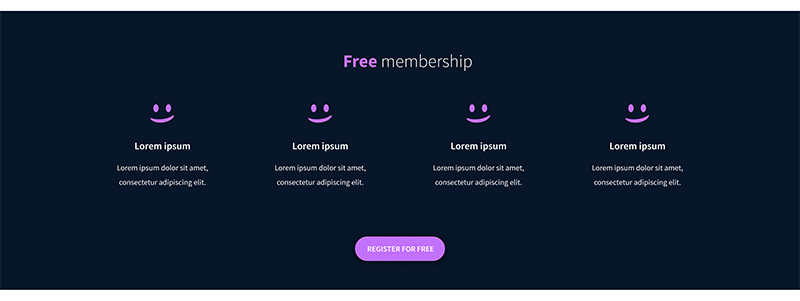

# CSS, advanced Project

CSS  Responsive design

## Learning Objectives

At the end of this project, you are expected to be able to explain to anyone, without the help of Google;

1. What is CSS?
2. How to add style to an element
3. What is a class?
4. What is a selector?
5. How to compute CSS Specificity Value
6. What are Box properties in CSS?
7. How does the browser load a webpage?

## Requirements

### General

1. All your files should end with a new line
2. A README.md file, at the root of the folder of the project is mandatory
3. You are not allowed to install, import or use external libraries. This website must be build with only HTML/CSS/JavaScript. No NodeJS, React, VueJS, Bootstrap, etc.
4. Your code should be W3C compliant and validate with W3C-Validator.

## Tasks

0. README and objectives!

This project is following the HTML, advanced project - please make sure all tasks of this previous one are fully done.

For this project, you will focus on the CSS and the style of the page.

This designer file will be available on Figma - feel free to create an account to access the final result here:

Page in Figma

fig file

Images

And “Duplicate to your Drafts” to have access to all design details. (if not already done)
For this task, please write an amazing README.md and copy the index.html file from HTML, advanced

1. Import the style

Before starting the implementation of the Style:

Create the file styles.css

Import styles.css in the head of your index.html

2. Header and Banner

Based on the Figma file, add the correct styling to the header and first section of the page

Reminders:

All colors values, width, height and images are part of the Figma

Keep your CSS simple and clean - use as simple as you can CSS selectors

Be accurate - the final result should be the same as the page at the end!

3. Quotes

Based on the Figma file, add the correct styling to the quote section

Tips:
You can start to see similar or common style, time to start to centralize your style and CSS selectors

4. Videos list

Based on the Figma file, add the correct styling to the videos list section

5. Membership

Based on the Figma file, add the correct styling to the membership section

6. FAQ

Based on the Figma file, add the correct styling to the FAQ section

7. Footer

Based on the Figma file, add the correct styling to the footer

## COLLABORATORS

This is solely Hezerone Okoth's project.

## LICENCE

Students and Developers can use this code however they can so long as it does not infringe on exsting regulations. Caution should be exercised.
In regards with copyright, all lie with the developer.
