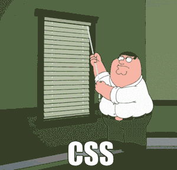

# CSS, basic Project

CSS

## Learning Objectives

At the end of this project, you are expected to be able to explain to anyone, without the help of Google;

1. What is CSS
2. How to add style to an element
3. What is a class
4. What is a selector
5. How to compute CSS Specificity Value
6. What are Box properties in CSS
7. How does the browser load a webpage

## Requirements

### General

1. All your files should end with a new line
2. A README.md file, at the root of the folder of the project is mandatory
3. You are not allowed to install, import or use external libraries. This website must be build with only HTML/CSS/JavaScript. No NodeJS, React, VueJS, Bootstrap, etc.
4. Your code should be W3C compliant and validate with W3C-Validator.

## COLLABORATORS

This is solely Hezerone Okoth's project.

## LICENCE

Students and Developers can use this code however they can so long as it does not infringe on exsting regulations. Caution should be exercised.
In regards with copyright, all lie with the developer.
